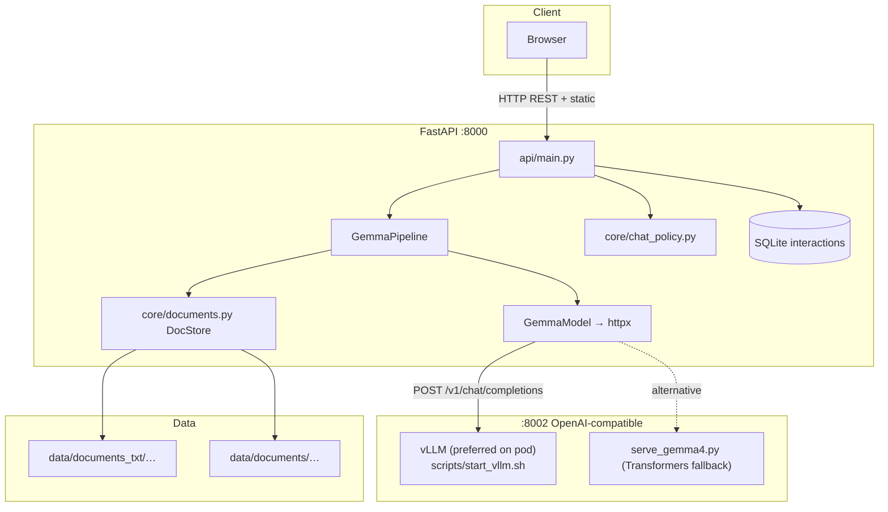
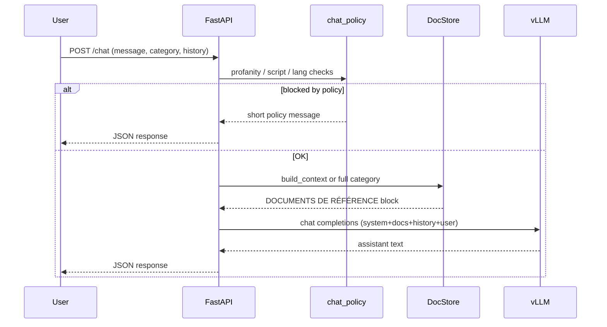
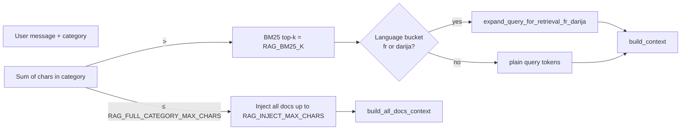

# Architecture — gemma-test (SENDIT internal chatbot)

Canonical description of how the repo is wired: **FastAPI backend**, **React UI (`web_test`)**, **category-aware RAG**, and **OpenAI-compatible inference** (primary: **vLLM** on the GPU pod; optional: `serve_gemma4.py` via Transformers).

---

## 1. System overview (Mermaid)



---

## 2. Chat request path (sequence)



---

## 3. RAG: full category vs BM25

Categories are subfolders under `data/documents/<category>/` (Word) or `data/documents_txt/<category>/` (preferred plain text from `scripts/export_sop_to_txt.py`).



**Important:** French keyword / synonym expansion for BM25 is **only** applied when the detected bucket is `fr` or `darija`. **English** (and other buckets such as MSA `ar`) keep the retrieval query in normal words — no French stuffing (`core/llm.py`, `core/documents.py`).

---

## 4. Main modules

| Layer | Path | Role |
|--------|------|------|
| HTTP API | `api/main.py` | Routes: chat, auth, categories, health, static `web_test/dist` if built |
| Schemas | `api/schemas.py` | Pydantic request/response models |
| Pipeline | `core/pipeline.py` | `GemmaPipeline.process` → `GemmaModel.generate` |
| LLM client | `core/llm.py` | Builds system prompt + RAG block; calls `VLLM_BASE_URL`; `SYSTEM_PROMPT` rules (language, context, continuations) |
| Policies | `core/chat_policy.py` | Language bucket, profanity, unsupported scripts, retrieval anchor query, “not found” normalisation |
| Documents | `core/documents.py` | Load `documents_txt` / `.docx`, BM25 index per category, `DocStore` |
| Settings | `app_config/settings.py` | Env-backed: vLLM URL, RAG limits, auth, rate limits, generation defaults |
| Persistence | `core/persistence.py` | SQLite interaction logging |
| Security | `core/security.py` | Cookie sessions, admin vs user |
| UI | `web_test/src/…` | Vite/React client; API base URL in `web_test/src/services/api.js` |

---

## 5. Inference on the pod

**Preferred:** **vLLM ≥ 0.19** with tensor parallelism across **2× A40** (Gemma 4 MoE).

- Setup: `scripts/install_vllm.sh` → venv `/workspace/vllm-venv`
- Start: `bash scripts/start_vllm.sh [gemma4|gemma|gemmaroc|atlaschat]`
- Listens on **port 8002**, OpenAI-compatible **`POST /v1/chat/completions`**, **`GET /health`**
- Env knobs (typical): `VLLM_TENSOR_PARALLEL_SIZE=2`, `VLLM_MAX_MODEL_LEN`, `VLLM_GPU_MEMORY_UTILIZATION`
- `serve_gemma4` processes are killed when starting vLLM (see `start_vllm.sh`)

**Fallback / legacy:** `scripts/serve_gemma4.py` — single-process FastAPI + Transformers + optional CPU offload; same HTTP shape as vLLM for the backend client.

Backend **does not** embed the model; it only needs `VLLM_BASE_URL` pointing at whatever serves `/v1/chat/completions`.

---

## 6. Language, system prompt, and context

- **Detection & policy** live in `core/chat_policy.py` (`detect_lang_bucket`, etc.).
- **Generation rules** (RAG usage, FR / EN / MSA / Darija behaviour, “continue”, source line, out-of-document answers) are in **`SYSTEM_PROMPT`** in `core/llm.py`. The API appends the **DOCUMENTS DE RÉFÉRENCE** section after that block when a category is selected.
- **Retrieval query expansion** for BM25 is gated: `expand_fr_darija_hints=(bucket in ("fr", "darija"))` inside `GemmaModel.generate`.

---

## 7. Deployment notes

- Automation helpers live under **`artifacts/`** (e.g. `pod_deploy.py`) — paths and SSH details may be environment-specific; adjust before running.
- Typical pod flow: install vLLM once → `git pull` → `start_vllm.sh` → start backend with uvicorn on **8000** (e.g. `uvicorn api.main:app --host 0.0.0.0 --port 8000`).
- Frontend: build `web_test` (`npm run build`) so `web_test/dist` can be served by FastAPI, or run Vite dev server with CORS origins in `FRONTEND_ALLOWED_ORIGINS`.

---

## 8. Environment variables (summary)

See **`.env.example`**. Notable keys:

| Variable | Purpose |
|----------|---------|
| `VLLM_BASE_URL` | Base URL for inference (e.g. `http://localhost:8002` when tunneled from pod) |
| `VLLM_MODEL_NAME` | Must match `--served-model-name` in vLLM (e.g. `gemma4-26b-it`) |
| `RAG_FULL_CATEGORY_MAX_CHARS` | Below this → inject entire category; above → BM25 |
| `RAG_INJECT_MAX_CHARS` | Cap on injected document text |
| `RAG_BM25_K` | Top-k documents for BM25 |
| `API_PORT` | Uvicorn port (default 8000) |

---

## 9. Local access via SSH tunnel

```bash
ssh -L 8000:localhost:8000 -L 8002:localhost:8002 <your-pod-alias>
# API: http://localhost:8000
# vLLM: http://localhost:8002
```

---

## 10. Optional LaTeX figure (TikZ)

Compile with `pdflatex` (package **`tikz`**):

```latex
\documentclass[tikz,border=4pt]{standalone}
\usetikzlibrary{arrows.meta,positioning}
\begin{document}
\begin{tikzpicture}[
  node distance=6mm and 10mm,
  box/.style={draw, rounded corners, align=center, inner sep=4pt, font=\small},
  arr/.style={-{Stealth}, thick}]
  \node[box] (u) {User\\\texttt{web\_test}};
  \node[box, right=of u] (api) {FastAPI\\\texttt{api/main.py}};
  \node[box, right=of api] (rag) {RAG\\\texttt{DocStore}};
  \node[box, below=of api] (v) {vLLM :8002\\\texttt{start\_vllm.sh}};
  \draw[arr] (u) -- (api);
  \draw[arr] (api) -- (rag);
  \draw[arr] (api) -- (v);
\end{tikzpicture}
\end{document}
```

---

## 11. Checkpoint / ops habits

- Prefer **`artifacts/`** for one-off diagnostic scripts; avoid littering the repo root.
- After changing inference (vLLM flags, model path) or RAG defaults, update this file and `.env.example` if new variables appear.

---

## 12. Git

`https://github.com/chafiyounes/gemma-test`
