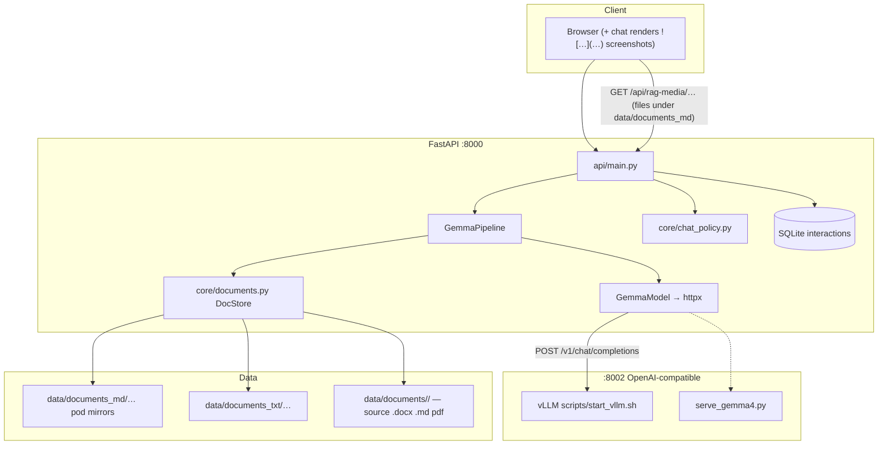
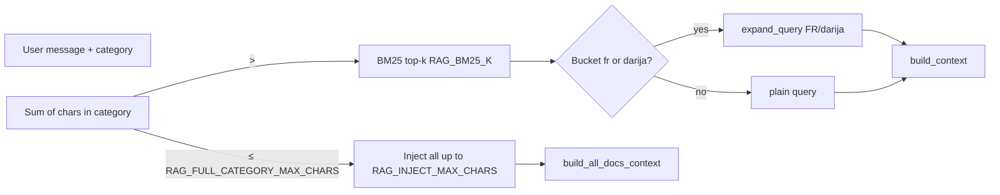

# Architecture — gemma-test (SENDIT internal chatbot)

**Stack:** FastAPI (`:8000`), React (`web_test` → `dist/`), category-aware **RAG**, **OpenAI-compatible** inference (**vLLM** `:8002`; optional `serve_gemma4.py`). SQLite for interactions. Companion: [`DATA_LAYOUT.md`](DATA_LAYOUT.md) (where corpus files live), [`DEPLOYMENT.md`](DEPLOYMENT.md) (SSH, pod, glitches), [`ROADMAP.md`](ROADMAP.md) (priorities, actions beyond chat).

---

## 1. System overview

---

## 2. Chat path (classic vs agentic)

**Classic RAG:** `POST /chat` → policy → DocStore builds **DOCUMENTS DE RÉFÉRENCE** (full category or BM25) → one vLLM completion with `SYSTEM_PROMPT` + docs + history.

**Agentic RAG** (optional, `AGENTIC_RAG_ENABLED=true` and client `agentic_rag: true` for admin unless `AGENTIC_RAG_ALLOW_NON_ADMIN`): **two-phase** by default (`AGENTIC_RAG_TWO_PHASE`):

1. **Router** — English system prompt + JSON **catalog** per indexed doc: `id`, `path`, `objective`, `section_1` (heuristic extract from SOP body). Model calls tool **`request_documents(ids)`**; backend returns **full** bodies from `DocStore`. First vLLM round uses a **forced** `tool_choice` for `request_documents` so the router cannot “finish” without a tool call. Up to **`AGENTIC_RAG_ROUTER_MAX_ROUNDS`** rounds; **`AGENTIC_RAG_ROUTER_MAX_IDS_PER_ROUND`** ids per call; **`AGENTIC_RAG_ROUTER_MAX_TOTAL_IDS`** unique docs cap (default aim **~5**, max **10** via settings + prompts).
2. **Answer** — Second completion: normal **`SYSTEM_PROMPT`** + same **DOCUMENTS DE RÉFÉRENCE** block formatting as classic RAG (`format_retrieved_documents_for_prompt`, greedy inject / query windows). **No tools.** Metadata must keep **`tool_rounds`** from the router (answer phase must not overwrite it with `0`).

**Not-found:** If the router retrieves nothing, response uses the configured agentic not-found string; `normalize_not_found_response` applies as in classic RAG.

**Code:** `core/agentic_rag.py` (catalog, router, tools), `core/llm.py` (`generate_agentic_rag`), `api/main.py` (agentic branch), `app_config/settings.py` (`AGENTIC_*`).

---

## 3. RAG: full category vs BM25

**Where files live (source of truth):** see [`DATA_LAYOUT.md`](DATA_LAYOUT.md) — canonical tree is `data/documents/<category>/`; **`documents_md`** may exist **only on the pod** as generated output from `.docx` pipelines; native `.md` sources stay under `data/documents/`.

Sources: prefer `data/documents_md/<category>/`, else `documents_txt`, else `.docx` / `pdf/*.pdf` (**pypdf**).

**French/Darija expansion** for BM25 only when the language bucket is `fr` or `darija` — not for English/MSA retrieval query construction (`core/llm.py`, `core/documents.py`).

### 3.1 Greedy inject (`RAG_GREEDY_FULL_DOCS=true`)

`_greedy_inject_document_blocks` + `_best_window_for_query`: prefer **full** top-ranked files, then **at most one** query-aligned excerpt; avoid thin slices of every file. Agentic answer phase reuses the same helpers.

### 3.2 Optional map / embeddings “test track”

Separate from the **runtime catalog** above: scripts can build **`data/agentic_map`** (titles/tags) and **`data/agentic_index`** (E5 embeddings) for **BM25/E5 map search** experiments. Commands: `scripts/bootstrap_agentic_map.py`, `scripts/build_agentic_embedding_index.py`. If you do not build them, agentic flow still works off **DocStore** catalog. See settings `AGENTIC_RAG_MAP_DIR`, `AGENTIC_RAG_INDEX_DIR`, `AGENTIC_RAG_USE_EMBEDDINGS`.

---

## 4. Gemma 4 tool use (vLLM)

Agentic mode needs vLLM started with **Gemma 4 tooling** (see `scripts/start_vllm.sh` when `TARGET=gemma4`): e.g. `--enable-auto-tool-choice`, `--tool-call-parser gemma4`, Gemma 4 **tool** chat template (often vendored under `scripts/vendor/`). If tools are misconfigured, completions may lack `tool_calls` — smoke test: `scripts/test_agentic_rag_pod.py` (`vllm_tool_roundtrip`).

---

## 5. Main modules

| Layer | Path | Role |
|--------|------|------|
| HTTP | `api/main.py` | `/chat`, auth, categories, health, admin, static |
| Pipeline | `core/pipeline.py` | `process` / `process_agentic` |
| LLM | `core/llm.py` | `SYSTEM_PROMPT`, RAG block, vLLM client |
| Policy | `core/chat_policy.py` | Lang, profanity, anchors, not-found normalisation |
| Documents | `core/documents.py` | Load index, BM25, greedy inject, `_best_window_for_query` |
| Agentic | `core/agentic_rag.py` | Catalog, router, `request_documents`, formatting |
| Settings | `app_config/settings.py` | Env-backed knobs |
| UI | `web_test/` | Vite/React; chat markdown + screenshots; light/dark theme (`shared/theme/`) |
| Admin UI | `admin_site/` | Vanilla HTML/JS; paginated interaction list (`summary=1`); lazy RAG rebuild; theme tokens |
| Logigramme | `core/logigramme_llm.py` | Procedure → diagram code (SSH eval only) — see [`LOGIGRAMME.md`](LOGIGRAMME.md) |
| SOP sanitise | `core/sop_text_clean.py` | Strips destructive/binary image data; preserves `` for non-data URLs |

---

## 6. Inference on the pod

- **vLLM** on **8002** — `scripts/start_vllm.sh [gemma4|gemma|gemmaroc|atlaschat]`. Typical: Gemma 4 MoE, `VLLM_MAX_MODEL_LEN` vs `RAG_INJECT_MAX_CHARS` / `MAX_NEW_TOKENS` must stay within model context.
- **Fallback:** `scripts/serve_gemma4.py` (Transformers).

Backend only calls **`VLLM_BASE_URL`**; it does not load weights.

---

## 7. Language, prompts, and UI screenshots

### 7.1 Language and retrieval behaviour

Detection and rules in `core/chat_policy.py` and **`SYSTEM_PROMPT`** in `core/llm.py`. **DOCUMENTS DE RÉFÉRENCE** is appended when a category applies.

### 7.2 Screenshots (« où cliquer »)

- **Corpus:** SOP/help Markdown often includes **``** (or `` in HTML sources). **`core/sop_text_clean.py`** removes **`data:`** embedded blobs (prompt bloat); it **keeps** normal HTTP(S) URLs and **relative paths** as Markdown images so excerpts still carry copy-pastable screenshot lines where possible.
- **Model:** **`SYSTEM_PROMPT`** asks the assistant to reuse those image lines verbatim for hyper-specific navigation questions (**where to click**), only when they appear in the injected documents — **no invented paths**.
- **Serving files:** **`GET /api/rag-media/<path>`** is a **StaticFiles** mount on **`data/documents_md`** (see `DOCS_MD_DIR` in `core/documents.py`, mount in `api/main.py`). Image paths in answers should resolve under that tree (example: **`help_md/captures/step.png`**).
- **Chat UI:** **`web_test/src/components/MessageBubble.jsx`** turns standalone lines and **inline** ``, plus **`[label](*.png)`**-style links, into ``; relative URLs are prefixed with the API base + **`/api/rag-media/`**. See **`DATA_LAYOUT.md`** for placing assets next to mirrored `.md`.

---

## 8. Environment (summary)

Full list: **`.env.example`**. Highlights: `VLLM_*`, `RAG_*`, `AGENTIC_RAG_ENABLED`, `AGENTIC_RAG_TWO_PHASE`, `AGENTIC_RAG_ROUTER_MAX_TOTAL_IDS`, `AGENTIC_RAG_ROUTER_MAX_IDS_PER_ROUND`, `AGENTIC_RAG_ROUTER_MAX_ROUNDS`, `AGENTIC_RAG_ROUTER_TARGET_DOCS`, `MAX_NEW_TOKENS`.

---

## 9. Regression checks

- `python scripts/test_rag_inject_greedy.py`
- `python scripts/verify_map_rag_pipeline.py` (optional)
- On GPU pod with secrets: `python scripts/test_agentic_rag_pod.py`

---

## 10. Git

`https://github.com/chafiyounes/gemma-test`
