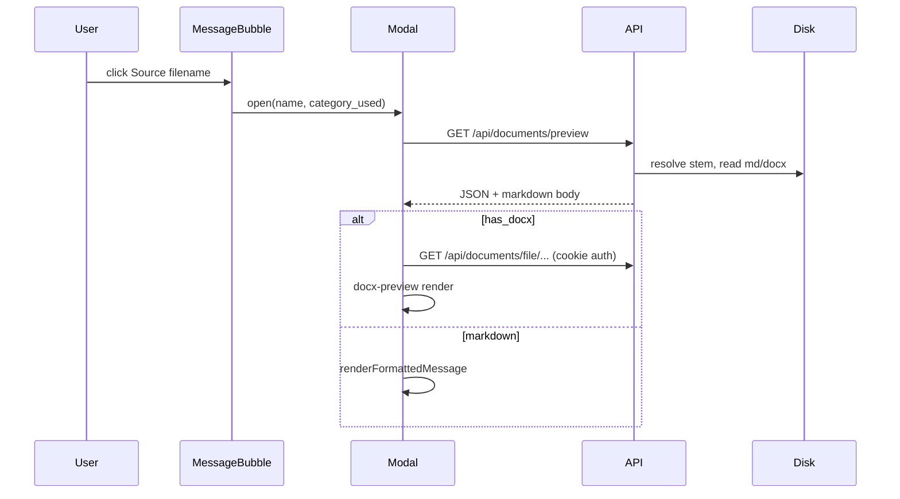

# Document preview (Source line) — isolated from chat

**Purpose:** Let users click the **Source:** footer on an assistant message to open an 80% viewport modal with the original `.docx` (in-browser) or cleaned Markdown (trailing link blocks removed).

**This subsystem does not participate in RAG or `/chat` inference.** It only reads files already on disk / indexed in `DocStore`.

Companion: [`ARCHITECTURE.md`](ARCHITECTURE.md), [`DATA_LAYOUT.md`](DATA_LAYOUT.md), [`DEPLOYMENT.md`](DEPLOYMENT.md).

---

## 1. Isolation from chat (do not mix deploys)

| Layer | Chat path (must stay stable) | Preview path (safe to iterate) |
|-------|------------------------------|--------------------------------|
| API | `POST /chat`, policy, vLLM, RAG inject | `GET /api/documents/preview`, `GET /api/documents/file/{cat}/{file}` |
| Backend modules | `core/llm.py`, `core/pipeline.py`, `core/documents.py` (index only) | `core/document_preview.py` |
| Frontend | `ChatArea`, `sendChat`, history | `DocumentPreviewModal.jsx` (lazy-loaded), `messageFormat.jsx` |
| Trigger | Every message | Only when user clicks **Source:** |

**Rules for future work:**

1. Do **not** change `POST /chat`, `core/llm.py`, or RAG inject when shipping preview-only fixes.
2. Preview UI is **`React.lazy`** — a broken preview bundle must not prevent the chat from loading.
3. Preview failures surface only in the modal (404, render error); the message bubble and feedback UI stay usable.
4. Prefer separate commits: `feat(preview): …` vs `fix(chat): …`.

---

## 2. Architecture



### Source name resolution

The model often cites a **document title** (e.g. `Gestion de la modification d'adresse e-mail`), not the on-disk stem (e.g. `Gestion de la modification d_adresse e-mail _3_.docx`). Preview resolves by:

1. Token overlap against indexed **stem**, **filename**, and **first heading / title line** in the body.
2. Fuzzy scan of `data/documents/<cat>/*.docx` and `data/documents_md/<cat>/**/*.md` when the index match is weak.
3. URL-encoded download paths for stems with spaces, accents, or subfolders (`{filename:path}`).

### Endpoints (authenticated, same session as chat)

| Method | Path | Notes |
|--------|------|--------|
| `GET` | `/api/documents/preview?name=…&category=…` | JSON: `has_docx`, `has_md`, `markdown`, `docx_url` |
| `GET` | `/api/documents/file/{category}/{stem}.docx` | `FileResponse`; path hardened (no `..`) |

Public **`/api/rag-media/`** is unchanged (images in Markdown body only).

### Code map

| File | Role |
|------|------|
| `core/document_preview.py` | Resolve name → stem, `strip_trailing_link_section`, payload |
| `api/main.py` | Routes above (`Depends(_require_user)`) |
| `api/schemas.py` | `DocumentPreviewResponse` |
| `web_test/src/lib/messageFormat.jsx` | Shared markdown renderer |
| `web_test/src/components/DocumentPreviewModal.jsx` | Modal + docx-preview |
| `web_test/src/components/MessageBubble.jsx` | Clickable Source + lazy modal |

---

## 3. Reversibility (evaluate before each action)

| Action | Reversible? | How to roll back |
|--------|-------------|------------------|
| `git revert` preview commit | Yes | Revert on `main`, redeploy |
| `deploy_runner --skip-deps` | Yes | Redeploy previous commit SHA |
| Pod `git pull` only | Yes | `git checkout <old-sha>` + `restart_api.sh` + rebuild `web_test/dist` |
| New API routes | Yes | Old clients ignore them; remove routes in revert |
| `npm` add `docx-preview` | Yes | Remove dep + rebuild dist |
| Lazy modal chunk | Yes | Remove lazy import; chat works without preview |
| `strip_trailing_link_section` | Yes | Display-only; does not alter RAG index |
| Changing `core/llm.py` / RAG | **Risky** | Affects every answer — **not part of preview subsystem** |

---

## 4. Deploy and test (agent workflow)

From repo root on a machine with SSH to the pod:

```powershell
git status
git add <preview files only>
git commit -m "feat(preview): Source-line document modal (isolated from chat)"
git push origin main
python scripts/deploy_runner.py --skip-deps
```

**Smoke checks after deploy:**

1. `GET /health` — API up.
2. Log in to SPA; send a chat message — reply still works (preview not involved).
3. Open a reply with **Source:**; click filename — modal loads Word and/or Markdown.
4. Wrong source name — modal shows error, chat still usable.

---

## 5. Markdown display rules

- **Source:** server reads `data/documents_md/<cat>/<stem>.md` if present, else indexed `DocStore` text.
- **`strip_trailing_link_section`** removes trailing blocks of link-only lines (and headings like « Liens », « Voir aussi ») for **preview only** — not applied during RAG indexing (`clean_sop_markdown` unchanged).

---

## 6. Related but separate (screenshots in answers)

Screenshot lines in chat (`` → `/api/rag-media/`) are documented in **ARCHITECTURE §7.2**. Those changes touch `core/sop_text_clean.py` and `core/llm.py` and **do affect chat** — deploy them in a **separate** commit from document preview.
