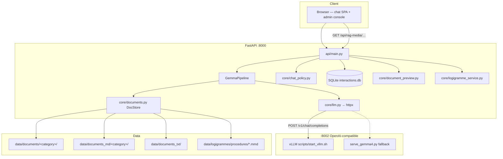

# Gemma-Test (SendBot) — Architecture Summary

**Project:** Internal SENDIT customer-support chatbot  
**Repository:** [github.com/chafiyounes/gemma-test](https://github.com/chafiyounes/gemma-test)  
**Purpose of this document:** Single reference for system design, data flow, modules, and deployment topology — suitable for reports and presentations.

**Complete commit history:** [`CHANGELOG.md`](CHANGELOG.md) · **Documentation map:** [`COVERAGE_INDEX.md`](COVERAGE_INDEX.md)

---

## 1. Executive overview

SendBot is a **category-aware RAG chatbot** for SENDIT logistics staff. It answers procedural questions from an internal corpus of SOPs (Standard Operating Procedures) and help articles, in **French, Darija, English, and mixed language**.

| Layer | Technology | Port |
|-------|------------|------|
| Inference | **vLLM** (OpenAI-compatible API) | **8002** |
| Backend | **FastAPI** + SQLite | **8000** |
| Chat UI | **React** (Vite) → `web_test/dist/` | served by API |
| Admin console | Vanilla HTML/JS (`admin_site/`) | `/admin` |
| Dev frontend | Vite dev server | 5173 (local only) |

The backend **never loads model weights**. It calls vLLM over HTTP (`VLLM_BASE_URL`). RAG indexing, auth, policy, and persistence run in Python; generation runs on GPU via vLLM (or legacy `serve_gemma4.py` with Transformers).

**Production model (current):** Gemma 4 26B-IT MoE (`gemma4` key in `scripts/start_vllm.sh`), tensor-parallel across 2× A40 on RunPod.

---

## 2. System diagram



---

## 3. Repository layout

```
gemma-test/
├── api/                    # FastAPI app (main.py, schemas)
├── app_config/             # settings.py — env-backed configuration
├── core/                   # Business logic
│   ├── pipeline.py         # GemmaPipeline orchestration
│   ├── llm.py              # SYSTEM_PROMPT, RAG assembly, vLLM client
│   ├── chat_policy.py      # Language, profanity, anchors, not-found
│   ├── documents.py        # DocStore, BM25, greedy inject
│   ├── agentic_rag.py      # Two-phase catalog router
│   ├── document_preview.py # Source-line modal (isolated from chat)
│   ├── documents_admin.py  # Admin document CRUD
│   ├── logigramme_*.py     # Mermaid flowcharts for procedures
│   ├── chat_logigramme.py  # Explicit logigramme intent in chat
│   ├── persistence.py      # SQLite interactions + users
│   ├── security.py         # Auth, sessions, roles
│   └── sop_text_clean.py   # Strip data: URIs; preserve screenshot paths
├── web_test/               # React chat SPA (Vite)
├── admin_site/             # Admin static UI
├── shared/theme/           # Light/dark design tokens (chat + admin)
├── data/
│   ├── documents/          # Canonical corpus (gitignored by default)
│   ├── documents_md/       # Generated MD mirrors (pod-heavy)
│   ├── documents_txt/      # Optional plain-text fallback
│   ├── logigrammes/        # Mermaid sidecars for procedures
│   └── interactions.db     # Chat history + feedback
├── scripts/                # Deploy, vLLM, tests, pod helpers
├── project/                # Architecture & ops documentation
├── docs/                   # Runbooks
└── start_all.sh            # tmux: vLLM + API windows
```

---

## 4. Request paths

### 4.1 Classic RAG chat

```
POST /chat
  → Auth + rate limit
  → Resolve RAG scope (category: procedures | help_md | all | comma-list)
  → chat_policy (language bucket, anchors, preflight for greetings/off-topic)
  → DocStore retrieval:
       • Small category → inject ALL docs (up to RAG_INJECT_MAX_CHARS)
       • Large category → BM25 top-k (RAG_BM25_K)
       • FR/Darija → query expansion hints for BM25 only
  → Build DOCUMENTS DE RÉFÉRENCE block
  → vLLM completion (SYSTEM_PROMPT + docs + history)
  → Optional: continuation if finish_reason=length
  → Optional: RAG repair if model claims "not in docs" despite inject
  → Persist interaction + metadata.rag to SQLite
  → Return ChatResponse
```

### 4.2 Agentic RAG (optional, two-phase)

Enabled when `AGENTIC_RAG_ENABLED=true` and client sends `agentic_rag: true` (or multi-scope auto-routing with `AGENTIC_RAG_ON_MULTI_SCOPE`).

**Phase 1 — Router:** English system prompt + JSON catalog (id, path, objective, section_1). Model must call tool `request_documents(ids)`. Forced `tool_choice` on first round. Limits: ~5 target docs, max 10 total, configurable rounds.

**Phase 2 — Answer:** Normal SYSTEM_PROMPT + full document bodies (same formatting as classic RAG). No tools. Router `tool_rounds` preserved in metadata.

Requires vLLM with Gemma 4 tool flags (`--enable-auto-tool-choice`, `--tool-call-parser gemma4`).

### 4.3 Document preview (isolated subsystem)

Does **not** affect RAG or `/chat`.

```
User clicks Source: on message
  → GET /api/documents/preview?name=…&category=…
  → Resolve title → on-disk stem (fuzzy match)
  → Modal: Word tab (docx-preview) | Markdown | Logigramme (if sidecar exists)
```

### 4.4 Logigrammes (procedure flowcharts)

- **Storage:** `data/logigrammes/procedures/<stem>.mmd` (published); drafts per user under `drafts/<user_slug>/`
- **RAG merge:** On index load, published Mermaid appended to procedure text
- **Admin:** Generate/refine/save via dedicated API (not `/chat`)
- **Chat:** When user explicitly asks (*logigramme*, *flowchart*, etc.), attach diagram after text answer

### 4.5 Screenshots in answers (« où cliquer »)

- Corpus MD may contain ``
- `GET /api/rag-media/<path>` serves files under `data/documents_md`
- SYSTEM_PROMPT instructs model to reuse image lines verbatim for navigation questions
- Chat UI (`MessageBubble.jsx`) renders images with API base prefix

### 4.6 Chat policy & pre-LLM gates (`core/chat_policy.py`)

Before any vLLM call, the pipeline runs input policy:

| Gate | Behavior |
|------|----------|
| **Conversation preflight** | Greetings (*bonjour*, *salut*), help/meta (*comment ça marche*), and off-topic messages get a **fixed reply** without RAG or LLM (`classify_conversation_intent`, `conversation_preflight_response`) |
| **Continuation anchoring** | Short follow-ups (*continue*, *suite*, *كمل*) reuse the **last substantive user turn** for BM25 (`retrieval_anchor_query`) |
| **Language bucket** | `detect_lang_bucket` → FR / darija / en / mixed; drives answer language suffix and BM25 expansion rules |
| **Profanity** | Short blocklist; can short-circuit with policy message |
| **Unsupported script** | Non-Latin/non-Arabic scripts gated with user notice |
| **Not-found normalization** | Collapses model “not in docs” replies when policy applies (`normalize_not_found_response`) |
| **Absent-docs detection** | `claims_absent_in_docs_response` triggers optional RAG repair turn in `core/llm.py` |

---

## 5. RAG engine details

### 5.1 Document loading priority (per category folder)

1. `data/documents_md/<category>/**/*.md` — if at least one usable file
2. Else `data/documents_txt/<category>/`
3. Else `data/documents/<category>/` — `.docx`, native `.md`, `pdf/*.pdf`

Files dropped directly under `data/documents/` (no subfolder) are **ignored**.

### 5.2 Retrieval modes

| Condition | Behavior |
|-----------|----------|
| Category char sum ≤ `RAG_FULL_CATEGORY_MAX_CHARS` | Inject entire category (`build_all_docs_context`) |
| Larger corpus | BM25 top-k |
| `RAG_GREEDY_FULL_DOCS=true` | Prefer full top-ranked files + one query window excerpt |
| Multi-category BM25 | Global score ranking; soft cap 3 docs per folder |

### 5.3 Greedy inject & context budget

- `_greedy_inject_document_blocks` + `_best_window_for_query` avoid thin slices across many files
- `RAG_INJECT_MAX_CHARS`, `RAG_CHAT_HISTORY_RESERVE_CHARS`, `LLM_MAX_CONTEXT_TOKENS` must align with vLLM `--max-model-len`
- `core/sop_text_clean.py` strips embedded `data:` image blobs from prompt text

### 5.4 DOCX → Markdown pipeline (`core/docx_to_md.py`)

Word SOPs are converted for richer RAG text under `data/documents_md/<category>/`:

- **Lists** (numPr), **nested tables in cells**, heading styles → Markdown
- Optional **`DOCX_MD_DROP_METADATA_TABLES`** — strip boilerplate metadata tables (default off)
- **`condense_sop_plaintext`** / section handling — optional strip of sections after §5 for inject size (`35c6df6`)
- Admin **git-refresh** and **RAG reload** re-run conversion + DocStore index
- Scripts: `scripts/export_sop_to_md.py`, `scripts/docx_md_full_example_test.py`

### 5.5 Corpus ingestion (outside admin UI)

| Source | Tool | Output |
|--------|------|--------|
| SENDIT help center | `scrape_sendit.py` | `sendit_docs/` (Markdown from help.sendit.ma) → often copied into `data/documents/help_md/` |
| Bulk local upload | `scripts/upload_docs.py`, `upload_zip.py` | Pod `data/documents/` |
| Pod → laptop | `scripts/fetch_pod_tar.py` | Local corpus archive |

### 5.6 Optional experimental track

Separate from runtime catalog: `data/agentic_map` (titles/tags) and `data/agentic_index` (E5 embeddings) for map-search experiments. Production agentic path uses **catalog + `request_documents`** without requiring embeddings (`9a44d3f`).

---

## 6. Authentication & roles

| Role | Access |
|------|--------|
| **user** | Chat SPA, document preview, feedback |
| **manager** (gestionnaire) | Admin: interactions, documents, logigrammes, RAG reload |
| **administrator** | Full admin + git-refresh, user management, settings snapshot |

- Session cookies; passwords in `.env` (`USER_SITE_PASSWORD`, `ADMIN_SITE_PASSWORD`)
- Named staff seeding via `SEED_STAFF_*` env vars
- CLI user management: `bash scripts/manage_users.sh`

### 6.1 Rate limiting

Per-session sliding window on `/chat`: **`RATE_LIMIT_MAX_REQUESTS`** (default 30) per **`RATE_LIMIT_WINDOW_SECONDS`** (default 60). Implemented in `api/main.py` middleware.

### 6.2 Feedback & liked-answer cache

**Feedback:** `POST /feedback` stores like/dislike + optional reason + comment in SQLite (`feedback` table). UI in `MessageBubble.jsx`; endpoint returns **204 No Content** (no JSON body).

**Liked-answer cache:** When **`LIKED_ANSWER_CACHE_ENABLED=true`**, identical questions (hash of message + category + model) can return a **cached liked answer** without calling vLLM. Cache invalidated on dislike. Administrator can flush via admin settings API. Table: `liked_answer_cache`.

---

## 7. Admin console architecture

**URL:** `http://<host>:8000/admin` (same origin as API)

| Feature | Implementation |
|---------|----------------|
| Interaction list | Paginated `GET /admin/interactions?summary=1` — lightweight rows |
| Detail view | Full response + metadata; lazy RAG reconstruction (`?reconstruct_rag=1`) |
| Document manager | Staged uploads, apply-plan workflow, category overview |
| Logigramme editor | Modal with generate/refine, auto-save drafts, publish |
| Git refresh | `POST /admin/git-refresh` — pull + npm build (administrator) |
| RAG reload | `POST /admin/rag-reload` — re-index from disk |
| Settings page | RAG mode + env snapshot (administrator) |
| Users tab | CRUD for staff accounts |

Performance (May 2026): infinite scroll, debounced search (300 ms), `"30 sur 847"` count display.

---

## 8. Frontend architecture

### 8.1 Chat SPA (`web_test/`)

- **Stack:** React 18, Vite, context-based state (`ChatContext.jsx`)
- **Key components:** `ChatArea`, `MessageBubble`, `DocumentPreviewModal` (lazy), `MermaidDiagram`, `AuthScreen`, `Sidebar`
- **API client:** `services/api.js` — cookies, feedback (204 No Content), debug RAG flags
- **Theming:** `shared/theme/` — light default, manual toggle, `localStorage.sendbot_theme`

### 8.2 Admin site (`admin_site/`)

- Vanilla HTML/JS; theme assets copied from `shared/theme/`
- Load order: `theme-light.css` / `theme-dark.css` → `theme-base.css` → `admin.css`

### 8.3 Design system

Shared SendBot tokens: copper accent (`#d97745` light / `#e8956a` dark), teal secondary. File-swap pattern for theme stylesheets. See `project/DESIGN_SYSTEM.md`.

---

## 9. Inference stack

### 9.1 vLLM (preferred)

```bash
bash scripts/start_vllm.sh gemma4   # production
# Also: gemma | gemmaroc | atlaschat
```

| Model key | Typical checkpoint |
|-----------|-------------------|
| `gemma4` | `/workspace/models/gemma4-26b-it` (MoE, TP=2) |
| `gemma` | Gemma 3 27B dense |
| `gemmaroc` | GemMaroc-27b-it |
| `atlaschat` | Atlas-Chat-27B |

Environment: `CUDA_VISIBLE_DEVICES`, `VLLM_MAX_MODEL_LEN`, `VLLM_GPU_MEMORY_UTILIZATION`.

### 9.2 Legacy fallback

`scripts/serve_gemma4.py` — Transformers + bitsandbytes INT8 when vLLM unavailable.

### 9.3 Model evolution (historical)

1. Initial: vLLM + GemMaroc-27B on port 8001
2. Port conflict → **8002** (RunPod sidecar on 8001)
3. Transformers fallback during CUDA/vLLM instability
4. Gemma 3 27B stability pass
5. **Gemma 4 26B MoE** via vLLM 0.19+ with tool-use for agentic RAG

---

## 10. Data architecture

### 10.1 Corpus layout

| Path | Role |
|------|------|
| `data/documents/<category>/` | **Authoritative source** — `.docx`, native `.md`, PDFs |
| `data/documents_md/<category>/` | Generated MD from DOCX pipeline (often **pod-only**) |
| `data/documents_txt/` | Optional plain-text fallback |
| `data/logigrammes/procedures/` | Mermaid sidecars |
| `data/interactions.db` | SQLite — all chat turns, feedback, metadata |

**Git policy:** `data/documents/` and `data/documents_md/` gitignored; optional force-add of `procedures/` snapshot for dev.

### 10.2 Categories (examples)

- `procedures` — SENDIT SOPs (~60 `.docx` on pod)
- `help_md` — Help-center articles (often nested `.md`)

Default chat category: `RAG_DEFAULT_CATEGORY` (typically `procedures`) when client omits scope.

---

## 11. Deployment topology

### 11.1 RunPod pod

```
tmux session "gemma-test"
  ├── window: vLLM (port 8002)
  └── window: FastAPI (port 8000)
```

**Deploy from laptop:**
```powershell
python scripts/deploy_runner.py --skip-deps        # pull + build + restart API
python scripts/deploy_runner.py --skip-deps --restart all   # reload vLLM too
```

**Gateway SSH:** `ssh.runpod.io` — non-interactive exec and SFTP often fail; use `pod_cmd.py` / `deploy_runner.py` (Paramiko + PTY) or direct root SSH when available.

**Corpus sync:** `python scripts/fetch_pod_tar.py` (base64 stream when scp blocked).

### 11.2 Local development

```bash
# Terminal 1: API
uvicorn api.main:app --reload --port 8000

# Terminal 2: Frontend
cd web_test && npm run dev   # :5173, proxies to :8000

# Optional tunnel to pod
ssh -L 8000:localhost:8000 -L 8002:localhost:8002 <pod>
```

---

## 12. Key environment variables

| Variable | Purpose |
|----------|---------|
| `VLLM_BASE_URL` | Inference endpoint (default `http://localhost:8002`) |
| `VLLM_MODEL_NAME` | Must match served model id |
| `RAG_INJECT_MAX_CHARS` | Hard ceiling for document context |
| `RAG_DEFAULT_CATEGORY` | Default scope when omitted |
| `AGENTIC_RAG_ENABLED` | Enable two-phase agentic path |
| `AGENTIC_RAG_ON_MULTI_SCOPE` | Auto-agentic for "all" scope |
| `MAX_NEW_TOKENS` | Generation limit |
| `SESSION_SECRET_KEY` | Cookie signing |
| `API_EXPOSE_ERROR_DETAIL` | Debug 500 messages (disable in prod) |

Full list: `.env.example`, `app_config/settings.py`.

---

## 13. Module reference

| Module | Responsibility |
|--------|----------------|
| `api/main.py` | All HTTP routes, static mounts, middleware |
| `core/pipeline.py` | `process()` / `process_agentic()` |
| `core/llm.py` | Prompts, RAG block, vLLM HTTP, continuations |
| `core/documents.py` | DocStore singleton, BM25, reload, greedy inject |
| `core/agentic_rag.py` | Catalog build, router, `request_documents` tool |
| `core/chat_policy.py` | Language detection, profanity, not-found normalization |
| `core/document_preview.py` | Title→stem resolution, trailing-link strip |
| `core/documents_admin.py` | Upload, delete, move, overview, apply-plan |
| `core/logigrammes_store.py` | Sidecar read/write, RAG merge |
| `core/logigramme_service.py` | Admin generate/refine/save |
| `core/chat_logigramme.py` | Chat keyword detection + diagram attach |
| `core/persistence.py` | SQLite schema, user seeding |
| `core/security.py` | Login, sessions, role checks |
| `core/admin_settings_snapshot.py` | Settings page env snapshot |

---

## 14. Observability & regression tooling

| Script | Purpose |
|--------|---------|
| `scripts/rag_audit.py` | Query corpus — missing topic vs retrieval issue |
| `scripts/test_rag_inject_greedy.py` | Greedy inject regression |
| `scripts/test_agentic_rag_pod.py` | Agentic + vLLM tool roundtrip on pod |
| `scripts/corpus_disk_vs_store.py` | On-disk files vs indexed docs |
| `scripts/check_health.py` | API + vLLM health |
| `scripts/ssh_runpod_diagnostics.py` | Remote pod diagnostics bundle |
| `scripts/runpod_recycle_pod.py` | RunPod REST recycle when GPU VRAM stuck |
| `scripts/export_sop_to_md.py` | Batch DOCX → MD export |
| `scripts/eval_logigramme_formats.py` | Logigramme format eval on pod |
| `scripts/manim_gemma_architecture.py` | Manim scenes for architecture presentations |
| `scripts/test_conversation_intent.py` | Preflight intent unit tests |
| `artifacts/pod_*.py` | One-off pod diagnostics (not all tracked in git) |

**Interaction metadata (`metadata.rag`):** `context_chars`, `documents_in_prompt`, `fetch_count`, `tool_rounds`, `mode`, `note`.

**Presentation assets:** `scripts/manim_gemma_architecture.py` renders filesystem + system topology videos for reports (commit `2383487`).

---

## 15. Future architecture (roadmap)

Phased **actions beyond read-only chat:**

| Phase | Direction |
|-------|-----------|
| A | Allow-listed tools with JSON schema validation |
| B | Read-only SQL (scoped, row limits) |
| C | Draft-only comms (email/Teams templates) |
| D | Action cards in UI + audit trail |
| E | Structured tool JSON in model loop |

Security hardening (password rotation, secret manager) explicitly secondary to **answer quality** and **RAG transparency** for now.

---

## 16. Related documentation

| Document | Topic |
|----------|-------|
| `project/DATA_LAYOUT.md` | Corpus folders, pod vs git |
| `project/DEPLOYMENT.md` | SSH, deploy scripts, pitfalls |
| `project/DOCUMENT_PREVIEW.md` | Source modal subsystem |
| `project/LOGIGRAMME.md` | Mermaid flowcharts |
| `project/DESIGN_SYSTEM.md` | Theme tokens |
| `project/ROADMAP.md` | Product priorities |
| `docs/runbook_runpod_quick_start.md` | Pod quick start |
| `project/SUMMARY_BUGS_AND_CHANGES.md` | Problems & fixes chronology |
| `project/SUMMARY_README.md` | How to use each component |
| `project/CHANGELOG.md` | All 147 commits (audit trail) |
| `project/COVERAGE_INDEX.md` | What is documented where; gap list |
